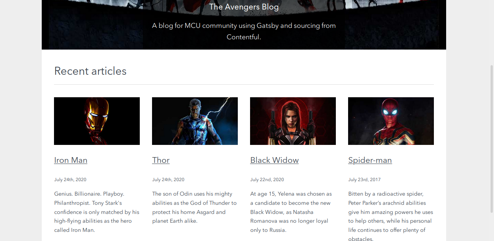
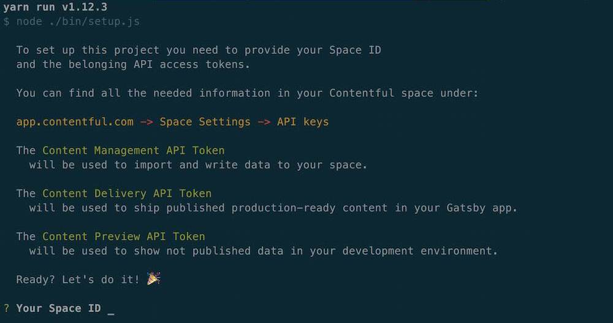

<!-- PROJECT LOGO -->
<br />
<p align="center">
    
</p>


# ⚠️gatsby-contentful Avengers Blog

[Gatsby](https://www.gatsbyjs.com/) [Contentful](https://www.contentful.com) Avengers Blog for MCU community.





## Requirements

To use this project you have to have a Contentful account. If you don't have one yet you can register at [www.contentful.com/sign-up](https://www.contentful.com/sign-up/).

## Getting started

Install [Yarn](https://yarnpkg.com/en/docs/install) (if you haven't already).

### Get the source code and install dependencies.

```
$ git clone https://github.com/Hachem-B/Avengers-Blog.git
$ yarn install
```

Or use the [Gatsby CLI](https://www.npmjs.com/package/gatsby-cli).

```
$ gatsby new contentful-starter https://github.com/Hachem-B/Avengers-Blog.git
```

### Set up of the needed content model and create a configuration file

This project comes with a Contentful setup command `yarn run setup`.


  

This command will ask you for a space ID, and access tokens for the Contentful Management and Delivery API and then import the needed content model into the space you define and write a config file (`./contentful.json`).

`yarn run setup` automates that for you but if you want to do it yourself rename `.contentful.json.sample` to `.contentful.json` and add your configuration in this file.

## Crucial Commands

This project comes with a few handy commands for linting and code fixing. The most important ones are the ones to develop and ship code. You can find the most important commands below.

### `yarn run dev`

Run in the project locally.

### `yarn run build`

Run a production build into `./public`. The result is ready to be put on any static hosting you prefer.

### `yarn run deploy`

Run a production build into `./public` and publish the site to GitHub pages.

### `yarn run cleanup-repository`

Removes all dependencies, scripts and data from the installation script.


